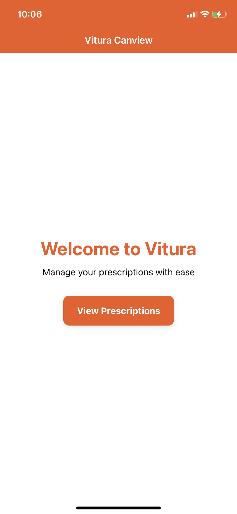
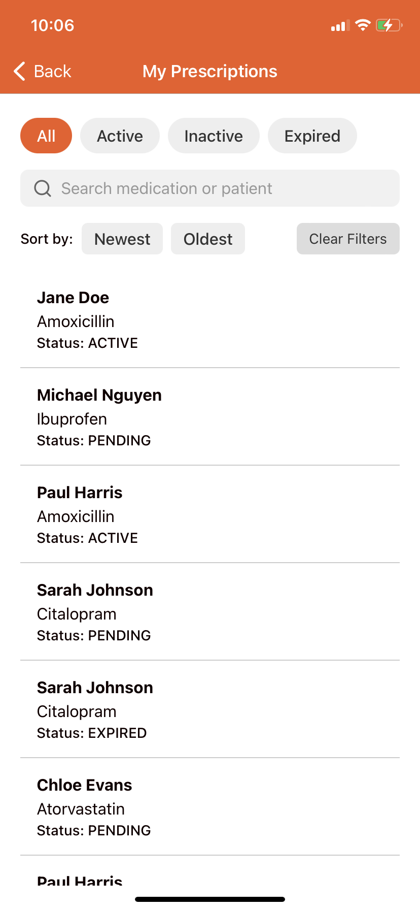

# Vitura Prescription Management App

This is a React Native app built with Expo and the latest `react-navigation` for Vitura's coding challenge. It allows users to view, search, filter, and sort a list of prescriptions and view details about each one.

<p align="center">
  
  
</p>

## 🛠️ Tech Stack

- **React Native** – Cross-platform mobile app development
- **Expo** – Simplifies React Native development, testing, and deployment
- **Redux Toolkit** – Simplified and scalable global state management
- **TypeScript** – Type-safe codebase for improved developer experience and maintainability
- **React Navigation v7** – Typed and modular navigation library (replaces `expo-router`)

---

## Project setup

### Prerequisites

- [Node.js](https://nodejs.org/) (>=14)
- [Expo CLI](https://docs.expo.dev/get-started/installation/)
- [Expo Go](https://expo.dev/go) app on your mobile device


### Installation

1. **Clone the repository**
```bash
git clone https://github.com/sanjaya1996/vitura-coding-challenge.git
cd vitura-coding-challenge
```

2. **Install dependencies**

```bash
npm install
# or
yarn install
```

### Running the App

Start the development server:

```bash
npx expo start
```
Scan the QR code in your terminal or browser using **Expo GO**  on your mobile device

## 📱 Preview the App on Expo Go:

Link: https://expo.dev/accounts/shawn-j/projects/vitura-coding-challenge/updates/cc1b12cb-7787-4d2d-8be5-1a5ebdb9ad06


---
## 📐 Architecture & State Approach

The project follows a modular and scalable folder structure for clarity and maintainability:

```text
├── assets/                          # App icons, images, screenshots

├── src/
│   ├── components/                  # Reusable UI components
│   │   ├── common/                  # Shared, generic components (e.g., Text, Button)
│   │   └── feature-specific/        # Feature-level components (e.g., FilterControls)
│   │       └── ComponentName.test.tsx   # Unit tests for components (NA)
│
│   ├── data/                        # Static or mock data
│   │   └── prescriptions.ts         # Example prescriptions data (mocked)
│
│   ├── navigation/                  # React Navigation setup
│   │   └── RootNavigator            # Rootnavigator config (Navigator, screens, types)
│   │   └── index.tsx                # NavigationContainer
│
│   ├── screens/                     # App screens
│   │   ├── HomeScreen.tsx           
│   │   ├── Prescriptions.tsx        
│   │   ├── PrescriptionDetails.tsx  
│
│   ├── store/                       # Redux Toolkit store
│   │   ├── slices/                  # Redux slices (e.g., prescriptionsSlice)
│   │   └── thunks/                  # Async thunks for data fetching
│
│   ├── styles/                      # Centralized styling system
│   │   ├── colors.ts                # App color palette
│   │   ├── constants.ts             # Spacing, font-size
│   │   ├── typography.ts            # Text types 
│
│   ├── utils/                      # Utility and helper functions
│       └── math/                    # Math-related utilities
│           ├── index.ts
│           └── index.test.ts        # (NA)

├── App.tsx                          # App entry point, registered via registerRootComponent
├── package.json                     # Project config and dependencies
```

- Navigation is handled using **react-navigation** with stack navigator approach and full type-safety.
- **State Management** is powered by **Redux Toolkit**:
  - `prescriptionsSlice` manages both the list of prescriptions and individual prescription details.
  - Async thunks simulate API calls using local static JSON data.
  - Uses React Hooks (useState, useEffect) for local state.
  - UI components are organized and reused via a `components/` folder. They are clean and focused only on rendering components
  - Styling is standardized using a `src/styles` folder for **fonts, colors, spacing and typography**, promoting consistent design throughout the app.


## 🤔 Assumptions Made

- 🔄 **Static Data Source** : 
    -  Prescription data is sourced from a local JSON file (`/data/prescriptions.ts`) to simulate backend responses. No real API integration is assumed for this project. 
    - It is also assumed that the data is clean, non-nullable, and non-corrupted. 
    - Prescription `status` will only be one of: `"active"`, `"expired"`, or `"pending"` 

- 🧭 **Navigation Structure**:
  - `react-navigation V7` is being used for the navigation 

- 🧠 **State Management**:
  - Redux Toolkit is used to manage global state.
  - The `prescriptionsSlice` manages both the list and details (as a key-value map) in a single slice for simplicity.
  - Async thunks are used to simulate API delay/response.

- 🎨 **Styling and Design**:
  -  UI design is kept simple and functional. Visual polish and styling refinements were not prioritized, as the core focus of this challenge was functionality, architecture, and state management.
  - No assumptions are made about specific branding/theming or design systems beyond what's provided in the challenge.

- ⚡ **Performance**: 

   - Assumed the prescriptions list could grow large, so memoization techniques were applied to improve performance.
  - Expensive operations like filtering and sorting are memoized to avoid recomputation on every render.
  - `PrescriptionListItem` is wrapped with `React.memo` to prevent unnecessary re-renders. This allows it to safely include more complex logic if needed without degrading performance.


- 🧱 **Folder Structure**:
  - Follows a modular folder structure separating concerns: screens (`/app`), components, data, store (slices/thunks), styles, and utilities.

- 🚫 **Limitations**:
  - Ui are not polished as the core focus was on the functionality 
  - No authentication or user-specific logic is assumed.
  - Data is not persisted between sessions.
  - Unit tests are not added 


---

## 📁 Folder Structure

The project follows a modular and scalable folder structure for clarity and maintainability:

## 📁 Folder Structure


> 📌 **Note:** Each module is self-contained. This structure improves scalability, reusability, and testability across the project.
